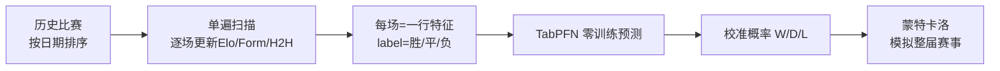
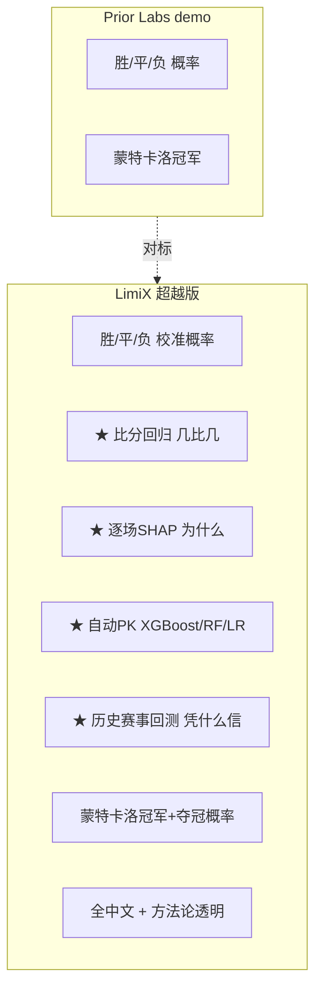
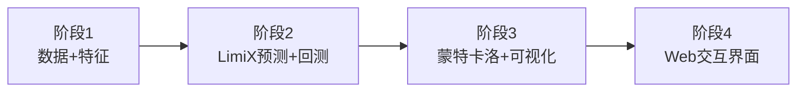

# LimiX 足球预测演示 — 调研与作战方案

> 日期：2026-06-22 ｜ 目标：复刻并**超越** Prior Labs 足球预测 demo，用 **LimiX 新版 API** 落地
> 数据源：Kaggle `martj42/international-football-results-from-1872-to-2026`
> 对标：`https://ux.priorlabs.ai/football`

---

## 0. TL;DR

Prior Labs 用世界杯把"结构化数据基础模型"包装成大众可玩的爆款 demo——上传历史比赛 → TabPFN 零训练预测 **胜/平/负三类校准概率** → 蒙特卡洛模拟数千次推演冠军。它**只预测胜平负**。

**LimiX 的超越点**：在同一份公开数据上，不止给胜平负，还**同步给比分回归 + 逐场可解释 + 自动 PK 传统 ML + 历史赛事回测诚实验证**。一句话——**"Prior Labs 告诉你谁会赢，LimiX 告诉你赢几比几、为什么、以及凭什么信它。"**

---

## 1. Prior Labs 足球 demo 拆解（对标对象）

### 1.1 它做什么
- **预测目标**：每场比赛输出 **3 个校准概率**——A 队胜 / 平 / B 队胜（例：巴西 vs 海地 = 85% / 11% / 3%）。
- **赛事推演**：把整届赛事 **模拟数千次**，找出最可能的冠军。
- **互动玩法**：时间轴排期 + 国旗对阵 + 用户自己选结果 vs 模型 PK + 计分（"4 中 3"）+ 可选登录保存。
- **模型**：TabPFN-3（结构化数据基础模型）。

### 1.2 特征工程（六大类，官方方法论原文要点）
| 类别 | 具体特征 | 说明 |
|---|---|---|
| **Elo 评分**（最重要） | 初始 1500，每场赛后按标准公式更新 | 胜负分差 + 赛事重要性做乘子；**非中立场主队 +65 分**主场优势 |
| **状态 Form** | 近 5 场 / 近 10 场场均积分(PPG) | 双窗口=即时战术 + 长期势头 |
| **进球统计** | 近 5 场进/失球 + 近 10 场净胜球 | 区分同分但攻击力不同的球队 |
| **连胜与休整** | 连胜场次 + 距上场天数(上限 90) | 势头 + 疲劳 |
| **交锋史 H2H** | 历史胜率/平局率/净胜球 | 针对性克制关系 |

### 1.3 关键工程纪律 ★
> **无未来泄漏**：所有特征在数据上**按时间单向单遍扫描**生成——开球时刻的每个特征只用"此前已踢过"的比赛。

这是整个 demo 可信度的基石，也是 LimiX 版必须严守的铁律。



---

## 2. Kaggle 数据集精确 schema

`martj42/international-football-results-from-1872-to-2026` — **49,393 场** 男子 A 级国际赛（1872 至 2025），含世界杯到友谊赛；不含奥运、B 队/U23。
**可直接从 GitHub raw 拉取，无需 Kaggle 登录**：`raw.githubusercontent.com/martj42/international_results/master/`

### results.csv（主表）
| 列 | 含义 |
|---|---|
| `date` | 比赛日期 |
| `home_team` / `away_team` | 主/客队名 |
| `home_score` / `away_score` | 全场比分（含加时，**不含点球**） |
| `tournament` | 赛事名（World Cup / Friendly...） |
| `city` / `country` | 比赛城市 / 国家 |
| `neutral` | TRUE/FALSE 是否中立场 |

### shootouts.csv（点球大战）
`date, home_team, away_team, winner, first_shooter`

### goalscorers.csv（进球明细）
`date, home_team, away_team, team, scorer, own_goal, penalty`

> **建模映射**：`home_score` vs `away_score` 派生 label（home_win/draw/away_win）；`neutral` 决定主场 Elo 加成是否生效；`shootouts` 用于淘汰赛模拟的平局判定。

---

## 3. LimiX 新版 API 能力对照

环境 `https://test001-limix.stable-ai.cn`（X-API-KEY 鉴权）。47 端点实测，主链路全通。本 demo 需要的端点：

| 能力 | 端点 | 用途 |
|---|---|---|
| 上传数据 | `POST /v1/data/files` | 上传训练/预测表（csv/xlsx/parquet）→ 得 data_version_id |
| **分类推理** | `POST /v1/inference/classification/predict` | 胜/平/负三类 + 校准概率 |
| **回归推理** | `POST /v1/inference/regression/predict` | 预测精确比分（主队/客队进球数） |
| 时序推理 | `POST /v1/inference/timeseries/predict` | （可选）球队 Elo/战力轨迹预测 |
| **评估报告** | `POST /v1/evaluation/*/reports` | 回测准确率/校准度，诚实验证 |
| **可视化** | `POST /v1/visualization/charts` | 概率条/混淆矩阵/校准曲线图 |
| **可解释** | `POST /v1/extensions/explanations/tasks` | 逐场 SHAP："为什么预测它赢" |
| 微调 | `POST /v1/extensions/finetuning/tasks` | （可选）在足球数据上微调专用模型 |

**分类推理输入契约**（关键）：
```json
{
  "train_data_version_id": "<上传训练表得到>",
  "predict_data_version_id": "<上传待预测表得到>",
  "target_column": "label",
  "model_type": "LIMIX_16M"   // 备选 64M(高质量)/7M/2M(低延迟)
}
```
训练表与预测表为标准二维表，**特征列同构**，分类表多一列 `label`。LimiX 原生处理缺失值/类别特征，无需独热。

> ⚠️ 实测已知坑（来自测试报告）：DELETE 路由 404、治理 confirm 500、数据生成缺 `icecream` 依赖、explanations 同步小样本会 180s 超时——本 demo 不踩这些，解释能力改用历史结果查询或容忍异步。

---

## 4. 超越方案：LimiX 版比 Prior Labs 强在哪



| 维度 | Prior Labs | **LimiX 超越版** |
|---|---|---|
| 胜平负概率 | ✅ | ✅ 校准概率 |
| **精确比分** | ❌ | ✅ 回归双输出（主/客进球） |
| **可解释性** | ❌（demo 未展示） | ✅ 逐场 SHAP，点出 Elo/Form 贡献 |
| **自动对比传统 ML** | ✅（Playground 有，足球 demo 无） | ✅ 直接在足球数据上 PK，价值不证自明 |
| **历史回测验证** | ❌ | ✅ 用 2018/2022 世界杯回测，**诚实报准确率** |
| 蒙特卡洛冠军 | ✅ | ✅ + 各队夺冠概率分布 |
| 语言/合规 | 英文 | 中文 + 私有化叙事 |

**护城河叙事**：复用我方既有判断——因果 / 零调参 / 可复现 / 中国市场。足球只是破圈钩子，落点是"同一套能力可迁移到金融风控、工业预测"。

---

## 5. 实施蓝图（分阶段）



### 阶段 1 — 数据管道与特征工程
- `data_loader.py`：从 GitHub raw 拉 results/shootouts/goalscorers，缓存本地。
- `features.py`：**按日期单遍扫描**，逐场生成 Elo / Form(5,10) / 进球 / 连胜休整 / H2H，严格无泄漏。产出 `matches_features.csv`（每场一行 + label + 比分）。

### 阶段 2 — LimiX 预测与回测
- `limix_client.py`：封装 上传→分类predict→回归predict→下载 的薄客户端。
- 切分训练/预测（按时间，如训练≤某届前，预测=某届）。
- **分类**：W/D/L 校准概率；**回归**：home_score/away_score。
- **回测**：对 2018/2022 世界杯小组赛跑评估报告，输出准确率/对数损失/校准。
- **自动 benchmark**：同数据本地跑 XGBoost/RF/LogReg 对照，生成"谁赢"对比表。

### 阶段 3 — 蒙特卡洛与可视化
- `tournament_sim.py`：基于 LimiX 概率，对赛程模拟 N 次（淘汰赛用比分/点球判定），输出各队夺冠概率。
- 调 `/v1/visualization/charts` 或本地 matplotlib：概率条、校准曲线、夺冠概率分布、回测混淆矩阵。

### 阶段 4 — Web 交互（复用 05-演示产品/web 风格）
- 时间轴排期 + 对阵卡（中文 + 国旗）+ 概率条 + **预测比分** + **SHAP 解释展开** + 用户 PK 计分。
- "LimiX vs 传统 ML"对比面板 + "历史回测成绩单"页。

---

## 6. 待你拍板的三个选择

1. **数据源**：直接用 GitHub raw（无需 Kaggle 账号，推荐）✅ 还是你已下载好的本地 Kaggle 包？
2. **演示赛事**：复刻"2026 大赛"做前瞻预测？还是用 **2022 世界杯回测**（有真值、能诚实秀准确率，售前更有说服力）？建议两者都做：回测建信任 + 前瞻造话题。
3. **起步范围**：先做 **阶段 1+2 命令行版打通 LimiX 链路**（快速见效、验证 API），还是直接奔 Web 完整版？建议先 1+2 跑通，再上 Web。

---

## 信息来源
- Prior Labs 足球 demo：https://ux.priorlabs.ai/football （含 Methodology）
- 既有深度调研：`03-调研分析/prior-labs-ux调研/Prior-Labs-调研报告.md`
- Kaggle 数据集：https://www.kaggle.com/datasets/martj42/international-football-results-from-1872-to-2017 ｜ GitHub 源：https://github.com/martj42/international_results
- LimiX API：`07-api合集/归档/*.md`、`07-api合集/limix_api_test_report_20260622.md`
